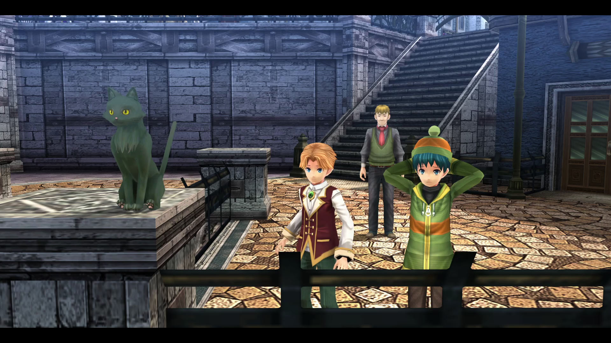

# Green Coppe CS2
Do you miss that Coppe the cat has a greenish tint from the Crossbell games? Worry not, because this mod has you covered! This mod allows for Coppe to be green again in Cold Steel II!

## Installation Instructions
- SenPatcher: You can just simply copy the p3a file, and paste it to the mod folder in your Trails of Cold Steel II directory (usually in C:\Program Files (x86)\Steam\steamapps\common\Trails of Cold Steel II\mods).
- Non-SenPatcher: Copy the C_NPC504_C08.pkg file in the edited folder, and paste it in C:\Program Files (X86)\Steam\steamapps\common\Trails of Cold Steel II\data\asset\D3D11, and overwrite the file.

## Uninstallation Instructions
- SenPatcher: You can just simply delete the p3a file in the mods folder.
- Non-SenPatcher: Copy the C_NPC504_C08.pkg file in the original folder, and paste it in C:\Program Files (X86)\Steam\steamapps\common\Trails of Cold Steel II\data\asset\D3D11, and overwrite the file.

## Credits
This mod would not be possible without:
- [SenPatcher](https://github.com/AdmiralCurtiss/SenPatcher) by AdmiralCurtiss
- [ED8 Model Toolset](https://github.com/eArmada8/ed8pkg2gltf) by eArmada8

Enjoy!
